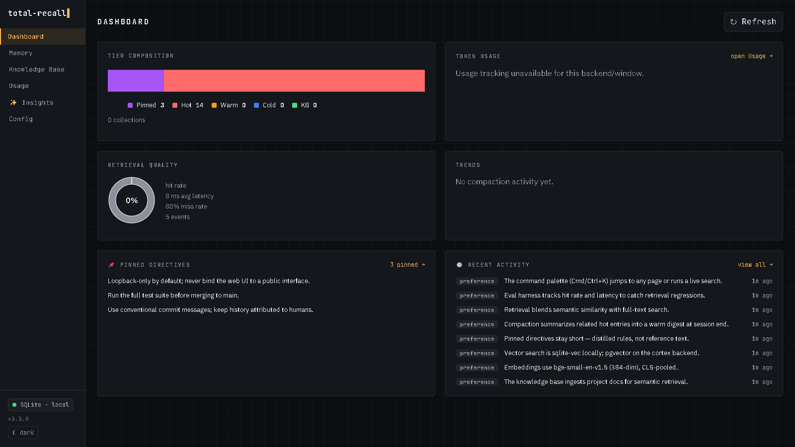

```
╔══════════════════════════════════════════════╗
║  REKALL INC. -- MEMORY IMPLANT SYSTEM v2.84  ║
╠══════════════════════════════════════════════╣
║                                              ║
║  CLIENT: Quaid, Douglas                      ║
║  STATUS: MEMORY EXTRACTION IN PROGRESS       ║
║                                              ║
║  > Loading tier: PINNED ......... [OK]       ║
║  > Loading tier: HOT ............ [OK]       ║
║  > Loading tier: WARM ........... [OK]       ║
║  > Loading tier: COLD ........... [OK]       ║
║  > Semantic index: 384 dimensions  [OK]      ║
║  > Vector search: ONLINE                     ║
║                                              ║
║  ┌──────────────────────────────────┐        ║
║  │ SELECT PACKAGE:                  │        ║
║  │                                  │        ║
║  │  [x] Total Recall -- $899        │        ║
║  │  [ ] Blue Sky on Mars            │        ║
║  │  [ ] Secret Agent                │        ║
║  └──────────────────────────────────┘        ║
║                                              ║
║  "For the Memory of a Lifetime"              ║
╚══════════════════════════════════════════════╝
```

[](https://github.com/strvmarv/total-recall/actions/workflows/dotnet-ci.yml)
[](https://www.npmjs.com/package/@strvmarv/total-recall)
[](https://opensource.org/licenses/MIT)

# total-recall

**Persistent, cross-tool memory for AI coding assistants.**

Your AI forgets everything when the session ends. Preferences, decisions, project context, corrections — gone. total-recall fixes that: a shared memory layer that persists across sessions, tools, and devices.

---

## The Problem

Every TUI coding assistant has the same gaps:

- **No memory between sessions** — every new session starts from zero, repeating the same context
- **Siloed by tool** — switching between Claude Code and Copilot CLI means starting from scratch
- **Single-machine** — your context doesn't follow you across devices
- **Context bloat** — stuffing everything into a `CLAUDE.md` wastes tokens every prompt
- **No token visibility** — no way to know what your AI sessions actually cost

---

## The Solution

- **Persistent memory** — corrections, preferences, decisions, and project context survive sessions automatically
- **Cross-tool** — one memory store shared across Claude Code, Copilot CLI, Cursor, Cline, OpenCode, and Hermes; existing memories auto-import on first run
- **Built-in web UI** — `total-recall ui` opens a local browser dashboard (Dashboard, Memory, Knowledge Base, Usage, Insights, Eval, Config) for visual memory management without touching the CLI or AI session. Dark/light themes, a keyboard-first ⌘K command palette, and a developer-native *Terminal / Archive* design
- **Cross-device** — point `TOTAL_RECALL_DB_PATH` at a cloud-synced folder and your memory follows you everywhere
- **Smarter context, lower token cost** — a four-tier model (Pinned / Hot / Warm / Cold) enforces a 4000-token budget per prompt, so you get relevant context without carrying everything
- **Token expenditure tracking** — see exactly what each session costs, broken down by host, project, and time window
- **Knowledge base** — ingest your docs, READMEs, API references, and architecture notes; retrieved semantically when relevant
- **Observability** — measure retrieval quality, run benchmarks, and compare config changes with the built-in eval framework

By default, all state is local: SQLite + vector embeddings, no external services, no API keys. For teams, configure a shared Postgres/pgvector backend and remote embedder — same binary, just config.

---

## Quick Start

### Self-Install (Paste Into Any AI Coding Assistant)

> Install the total-recall memory plugin: fetch and follow the instructions at https://raw.githubusercontent.com/strvmarv/total-recall/main/INSTALL.md

That's it. Your AI assistant will read the instructions and install total-recall for its platform.

### Claude Code

```
/plugin install total-recall@strvmarv-total-recall-marketplace
```

Or if the marketplace isn't registered:

```
/plugin marketplace add strvmarv/total-recall-marketplace
/plugin install total-recall@strvmarv-total-recall-marketplace
```

### npm (Any MCP-Compatible Tool)

```bash
npm install -g @strvmarv/total-recall
```

Then add to your tool's MCP config:

```json
{
  "mcpServers": {
    "total-recall": {
      "command": "total-recall"
    }
  }
}
```

This works with **Copilot CLI**, **OpenCode**, **Cline**, **Cursor**, **Hermes**, and any other MCP-compatible tool. The `total-recall ui` command is available independently of MCP configuration — it is a local management surface, not a host tool.

> **Note:** `npx -y @strvmarv/total-recall` does not work due to an [npm bug](https://github.com/npm/cli/issues/3753) with scoped package binaries. Use the global install (`total-recall` command) instead.

---

## What Gets Remembered

Every memory has an entry type that tells total-recall what it is and how to treat it.

| Entry Type | Stored When | Example |
|---|---|---|
| `Correction` | You fix a mistake the AI made | `"Use Array.from() not spread for NodeList — spread fails in our build target"` |
| `Preference` | You state a style or workflow preference | `"Always use const over let unless reassignment is needed"` |
| `Decision` | You make an architecture or design choice | `"Using Zustand for state — Redux was overkill for this app size"` |
| `Surfaced` | The AI captures context automatically | Key facts, constraints, or project-specific patterns noticed during work |
| `Imported` | First-run import from another tool | Your existing Claude Code memories, Copilot snippets, Cursor history |
| `Compacted` | Tier compaction generates a summary | Multiple related memories merged into a higher-signal entry |
| `Ingested` | You ingest a file or directory | Chunks from READMEs, API docs, architecture notes |

**`Correction` and `Preference` entries get priority treatment.** They surface as actionable hints at every session start and carry higher decay scores — they stay in hot tier longer and are less likely to be evicted.

---

## How It Works

### Four-Tier Model

total-recall uses a four-tier memory model designed to balance signal density with token cost:

- **Pinned** (user-curated, 500 chars per entry) — entries you pin via `memory_pin` (or store-and-pin with `memory_store { pinned: true }`). Always injected verbatim at session start, ahead of the hot tier, under a `## Pinned directives (always follow)` header — never truncated, never decayed, never demoted, never compacted. Oversized content is rejected at the door (configurable via `tiers.pinned.max_content_chars`). The only way out is `memory_unpin` (→ warm).
- **Hot** (up to 50 entries, 4000-token budget) — auto-injected into every prompt. Your most important corrections, preferences, and recently promoted entries are always present without any query. Pinned tokens come off the top of this budget.
- **Warm** (up to 10K entries) — retrieved semantically per query. When you ask about authentication, relevant auth memories surface automatically. Entries decay over time; unused ones migrate to cold.
- **Cold** (unlimited, hierarchical) — your knowledge base. Ingest entire directories — source trees, documentation, design specs — and they're retrieved when relevant.

### Hybrid Search

Retrieval combines **BM25 full-text search** and **cosine vector similarity**, merged by a pure F# ranking function. You get keyword precision when you search by exact terms and semantic recall when you describe what you need in natural language. The BM25/vector weight is tunable via `[search] fts_weight`.

### Embeddings

All memories are embedded with [bge-small-en-v1.5](https://huggingface.co/BAAI/bge-small-en-v1.5) (384 dimensions, CLS pooling, with an asymmetric query prefix for searches), running locally via ONNX — no API calls, no network dependency. The model (~133 MB) is fetched and sha256-verified at release build time and ships bundled inside the npm/release artifact; there is no runtime HuggingFace download. If the bundled model is absent, the binary fails fast with a clear error rather than fetching anything.

If you swap the local embedder, existing vectors are in the old model's space. By default (`embedding.on_model_change = "auto"`) the **sqlite** and **cortex** backends re-embed their local index automatically — a one-time re-embed that runs **in the background** after launch, not on the startup path. The server stays fully usable while it runs; local semantic retrieval is degraded until it finishes, and progress is reported through `session_start`/`status` (you'll see a "re-index in progress (N/M)" notice). It's batched and resumable, so restarting mid-re-index picks up where it left off rather than starting over. This also covers a pre-existing index that was never fingerprint-stamped (e.g. an older cortex database): if it holds vectors but carries no fingerprint, it is re-embedded too rather than silently left in a stale model space. Set `on_model_change = "warn"` to run with the stale vectors (degraded retrieval, recurring warning) or `"block"` to refuse to start. **Postgres** can't auto-migrate: under `auto` it stops with an actionable error — re-ingest into a fresh database or use `"warn"`. For **cortex**, only the local vector index is re-embedded (the remote re-embeds independently); `total-recall reindex-embeddings` runs the same re-embed offline for `warn`/`block` deferrals and manual re-embeds.

For enterprise deployments, swap in a remote embedder (OpenAI, Amazon Bedrock) for higher-dimensional vectors and finer-grained retrieval across shared team knowledge.

### Session Start

Every `session_start` call runs the same sequence:

1. **Import sync** — scans all installed host tools (Claude Code, Copilot CLI, Cursor, Cline, OpenCode, Hermes), deduplicates via content hash, and imports new entries.
2. **Pinned + hot tier assembly** — pinned entries are injected first, verbatim and untruncated, then current hot entries fill the remaining token budget.
3. **Hint generation** — surfaces up to 5 high-value warm memories as actionable one-liners: `Correction` and `Preference` entries first, frequently accessed entries (3+ accesses) second, recently promoted entries third. No LLM calls — pure DB queries.
4. **Tier summary** — counts entries across pinned, hot, warm, cold, and all KB collections (`tierSummary.pinned` included). A `pinned_budget_pressure` hint fires when pins consume over half the token budget (suggested action: `memory_unpin`).
5. **Session continuity** — reports human-readable time since the last compaction event (proxy for last active session).

Every `session_start` also runs a skill scan: it reads `~/.claude/skills/` plus any directories listed in `[skills] extra_dirs`, persists the content + a locally-computed embedding to a SQLite skill cache, and advertises discovered skills as an `## Available Skills` block in the session context. Scanned skills are invokable on demand via the `skill_get` MCP tool and discoverable via `skill_search` (hybrid semantic + keyword ranking with a usage-decay tie-breaker) — both work entirely offline with no Cortex required. In Cortex mode the scanned skills are also pushed to Cortex, usage events sync back as a multi-machine rollup, and pulled skills from other machines merge into the same local cache.

### Pinned-Directive Floor

Pinned directives are injected once at `session_start`, but in a long session they drift far enough up the transcript that the model stops honoring them. The **pinned floor** re-asserts the pinned block near the live edge on an adaptive throttle, so your pins keep being followed all session long.

A per-turn `UserPromptSubmit` hook runs before each prompt and re-injects the pinned block when **either** trigger trips since the last injection:

- `floor_every_n_turns` user turns have elapsed (default 6), **or**
- ~`floor_growth_tokens` of transcript growth has accumulated (default 6000).

The first turn of a session seeds the throttle and skips (the block was just injected at session start). The re-injected block is rendered verbatim — identical to the session-start block — and prefixed with a short reminder line. The hook is **fail-safe: it never blocks or rejects a prompt**. Disable it entirely with `floor_enabled = false`.

Per-host support:

| Host | Per-turn floor | Mechanism |
|---|---|---|
| Claude Code | Active | `UserPromptSubmit` hook → `additionalContext` |
| Copilot CLI | Pending upstream fix | Wired the same way, but Copilot CLI currently ignores the returned `additionalContext` |
| Cursor | Layered fallback | session-start injection + skill-guided `session_refresh` (Cursor's `beforeSubmitPrompt` is block-only and cannot inject context) |

---

## Supported Platforms

| Platform | Support | Notes |
|---|---|---|
| Claude Code | Full | Native plugin, session hooks, auto-import |
| Copilot CLI | Full | Plugin wrapper, session hooks, auto-import from Copilot memory files |
| Cursor | Full | Plugin wrapper, SessionStart hook; run `/total-recall:commands compact` manually — no SessionEnd hook |
| OpenCode | Full | Plugin wrapper, auto-import from OpenCode project and agent files |
| Cline | Full | Auto-import from task history; MCP server config required |
| Hermes | Importer | Auto-import from SOUL.md and skills on first run; no session hooks |

---

## Web UI

total-recall ships a built-in local web UI — a third surface alongside the MCP server (AI assistant integration) and the CLI (`total-recall status`, `total-recall eval`, etc.). It is a React SPA served directly from the single NativeAOT binary, no separate install or Node required.

**Design.** The UI has a developer-native *Terminal / Archive* identity: a monospace-forward type system (self-hosted **JetBrains Mono** + **IBM Plex Sans** — bundled into the binary, no CDN, fully offline), a fixed **left navigation rail**, a faint ruled-grid backdrop, and an amber phosphor accent. It ships **dark and light themes** with a toggle — your choice persists, and on first visit it follows your OS preference. A **⌘K / Ctrl-K command palette** jumps to any page and runs live search across memories and the knowledge base, so the whole UI is reachable from the keyboard.



```bash
total-recall ui                  # serve on http://localhost:5577 and open the browser
total-recall ui --port 5600      # custom port
total-recall ui --no-open        # suppress auto-open (e.g. remote / headless)
total-recall ui --host 0.0.0.0   # bind all interfaces (warns about exposure)
total-recall ui --token <tok>    # supply a fixed token instead of a per-launch random one
total-recall ui --smoke          # CI mode: start, GET /api/health, exit 0/1
```

The server binds **loopback only** (`localhost`) by default. Every launch generates a fresh ephemeral bearer token that is injected directly into the served HTML, so opening the URL in a browser is sufficient — no copy-paste of credentials. A Host-header allowlist mitigates DNS-rebinding.

**Seven sections** are available in the left navigation rail:

| Section | What it shows |
|---|---|
| Dashboard | Tier composition, retrieval quality, token usage, recent activity, trend sparklines |
| Memory | Browse, search, filter, promote/demote/pin/delete individual entries |
| Knowledge Base | List collections, search, ingest files/directories, refresh or remove collections |
| Usage | Token expenditure by host, project, model, and time window; per-session breakdown |
| ✨ Insights | Memory-health score with an expandable breakdown, plus actionable cards computed server-side from your local store (no LLM): merge near-duplicate memories, promote high-use entries to pinned, surface retrieval gaps, and tune the similarity threshold from a recall curve |
| Eval | Run the retrieval benchmark, review hit/miss/MRR with per-tier & per-content-type breakdowns and top misses, grow the benchmark from real retrieval misses, and compare config snapshots |
| Config | Edit a safe subset of tuning knobs (validated, persisted via `config_set`); storage & embedding shown read-only |

**Cost figures** in the Usage section are **client-side estimates** derived from a bundled model pricing table. They are not billed amounts.

The SPA build is **opt-in** (`-p:BuildSpa=true` triggers `npm ci && npm run build` in `ClientApp/` and embeds the Vite output in the assembly). Default `dotnet build` and all tests are Node-free — the binary falls back to a placeholder page when built without the SPA. Release builds always include the SPA.

---

## Commands

All commands are routed through the `/total-recall:commands` skill:

| Command | Description |
|---|---|
| `/total-recall:commands help` | Show command reference table |
| `/total-recall:commands status` | Dashboard overview |
| `/total-recall:commands search <query>` | Semantic search across all tiers |
| `/total-recall:commands store <content>` | Manually store a memory |
| `/total-recall:commands forget <query>` | Find and delete entries |
| `/total-recall:commands inspect <id>` | Deep dive on single entry with compaction history |
| `/total-recall:commands promote <id>` | Move entry to higher tier |
| `/total-recall:commands demote <id>` | Move entry to lower tier |
| `/total-recall:commands pin <id>` | Pin entry — always injected at session start, never decays |
| `/total-recall:commands unpin <id>` | Release a pinned entry back to the warm tier |
| `/total-recall:commands history` | Show recent tier movements |
| `/total-recall:commands lineage <id>` | Show compaction ancestry |
| `/total-recall:commands export` | Export to portable JSON format |
| `/total-recall:commands import <file>` | Import from export file |
| `/total-recall:commands ingest <path>` | Add files or directories to knowledge base |
| `/total-recall:commands kb search <query>` | Search knowledge base |
| `/total-recall:commands kb list` | List KB collections |
| `/total-recall:commands kb refresh <id>` | Re-ingest a collection |
| `/total-recall:commands kb remove <id>` | Remove KB entry |
| `/total-recall:commands compact` | Force compaction |
| `/total-recall:commands eval` | Retrieval quality metrics |
| `/total-recall:commands eval --benchmark` | Run synthetic benchmark |
| `/total-recall:commands eval --compare <name>` | Compare metrics between two config snapshots |
| `/total-recall:commands eval --snapshot <name>` | Manually create a named config snapshot |
| `/total-recall:commands eval --grow` | Review and accept/reject benchmark candidates from retrieval misses |
| `/total-recall:commands config get <key>` | Read config value |
| `/total-recall:commands config set <key> <val>` | Update config |
| `/total-recall:commands import-host` | Re-run import sync from all host tools |

Memory capture, retrieval, and compaction run automatically in the background — see the "Automatic Behavior" section of the `/total-recall:commands` skill.

> **Note:** `/total-recall:commands` is implemented as a Claude Code skill (at `skills/commands/SKILL.md`), not as a slash-command file under `commands/`. The skill handles all `<subcommand>` arguments internally.

---

## Configuration

The config file lives at `~/.total-recall/config.toml`. All fields have defaults — you only need to override what you want to change.

```toml
# total-recall configuration

[tiers.pinned]
max_content_chars = 500           # Max characters per pinned entry (oversize rejected, never truncated)
floor_enabled = true              # Per-turn pinned-directive floor (UserPromptSubmit re-injection)
floor_every_n_turns = 6           # Re-inject the pinned block at least every N user turns
floor_growth_tokens = 6000        # ...or after ~this many tokens of transcript growth (whichever trips first)

[tiers.hot]
max_entries = 50                  # Max entries auto-injected per prompt
token_budget = 4000               # Max tokens for hot tier injection (pinned tokens come off the top)
carry_forward_threshold = 0.7     # Score threshold to stay in hot

[tiers.warm]
max_entries = 10000               # Max entries in warm tier
retrieval_top_k = 5               # Results returned per search
similarity_threshold = 0.65       # Min cosine similarity for retrieval
cold_decay_days = 30              # Days before unused warm entries decay to cold

[tiers.cold]
chunk_max_tokens = 512            # Max tokens per knowledge base chunk
chunk_overlap_tokens = 50         # Overlap between adjacent chunks
lazy_summary_threshold = 5        # Accesses before generating summary

[compaction]
decay_half_life_hours = 168       # Score half-life (168h = 1 week)
warm_threshold = 0.3              # Score below which warm→cold
promote_threshold = 0.7           # Score above which cold→warm
warm_sweep_interval_days = 7      # How often to run warm sweep

[search]
fts_weight = 0.3                  # BM25 weight in hybrid ranking (0.0 = vector only, 1.0 = FTS only)

[scope]
default = "user"                  # Default scope for new entries (e.g., "user", "team")

[usage]
initial_backfill_days = 30        # Days of usage history to backfill on first sync

[regression]
miss_rate_delta = 0.1             # Alert if miss rate increased by this much vs. previous snapshot
latency_ratio = 2.0               # Alert if latency increased by this factor vs. previous snapshot
min_events = 20                   # Minimum retrieval events required before regression check runs

[embedding]
model = "bge-small-en-v1.5"      # Embedding model name
dimensions = 384                  # Embedding dimensions
# provider = "local"              # "local" (default) | "openai" | "bedrock"
# endpoint = "https://api.openai.com/v1"   # OpenAI-compatible base URL
# bedrock_region = "us-east-1"             # Bedrock only
# bedrock_model = "cohere.embed-v4:0"      # Bedrock model ID
# api_key = ""                             # or set TOTAL_RECALL_EMBEDDING_API_KEY env var

# --- Skills (optional) ---
# [skills]
# extra_dirs = [
#   "~/my-skills",
#   "/path/to/team-skills"
# ]

# --- Remote storage (optional) ---
# [storage]
# connection_string = "Host=localhost;Database=total_recall;Username=tr;Password=changeme"

# --- User identity (optional, Postgres only) ---
# [user]
# user_id = "alice"               # or set TOTAL_RECALL_USER_ID env var
```

**Relocating the database:** set `TOTAL_RECALL_DB_PATH` to an absolute path or `~/`-prefixed path. See [INSTALL.md](INSTALL.md#relocating-the-database) for cloud-sync and shared-workspace guidance.

**Switching to Postgres:** uncomment the `[storage]` section with your connection string. The binary auto-detects the backend — no code changes, no flag. Pair with `[embedding] provider = "bedrock"` or `"openai"` for remote embeddings. Run `migrate_to_remote` to copy local memories to the shared database with re-embedding.

### Connecting to Cortex

Total Recall Cortex is the shared backend platform that adds team knowledge bases, connectors (Jira, Confluence, GitHub), chat/RAG, and a React UI on top of the plugin's memory layer.

In Cortex mode, the plugin operates as a hybrid:
- **User memories** are stored locally (fast reads/writes), synced bidirectionally to Cortex every 300 seconds and at session boundaries
- **Pinned entries are local-only** — Cortex has no pinned-tier support yet, so pins are never pushed, pulled, reconciled, or migrated (`migrate_to_remote` skips them)
- **Global knowledge** (team KB, connector-ingested data) is queried remotely from Cortex
- **Telemetry** (usage, retrieval events, compaction log) is pushed to Cortex for unified dashboards
- **Skills** are synced to Cortex so team members share the same skill library

Configure in your `config.toml`:

```toml
[storage]
mode = "cortex"

[cortex]
url = "https://your-cortex-instance.example.com"
pat = "tr_your_personal_access_token"
sync_interval_seconds = 300       # Background sync interval (default: 300)
```

Or via environment variables:

```bash
export TOTAL_RECALL_CORTEX_URL="https://your-cortex-instance.example.com"
export TOTAL_RECALL_CORTEX_PAT="tr_your_personal_access_token"
```

Generate a PAT from the Cortex web UI under Settings → Personal Access Tokens.

**Offline resilience:** If Cortex is unreachable, the plugin continues working locally. A persistent sync queue buffers outbound changes and flushes automatically when connectivity is restored.

### Skills

total-recall can advertise custom skills at every `session_start` so your AI assistant knows which workflows are available. Skills are discovered from two places:

- **`~/.claude/skills/`** — the standard Claude Code user skills directory (always scanned)
- **`extra_dirs`** — additional directories you configure, scanned on every session start regardless of whether Cortex is available

Configure extra skill directories in `~/.total-recall/config.toml`:

```toml
[skills]
extra_dirs = [
  "~/my-custom-skills",
  "/path/to/shared/team-skills"
]
```

Paths can be absolute or `~/`-prefixed. Skills in `extra_dirs` are always advertised from disk — Cortex is not required.

**Skill format:** Each skill is either a single `.md` file or a directory containing a `SKILL.md` entry point. A minimal single-file skill:

```markdown
---
name: my-skill
description: Does something useful
---

Full skill content here...
```

A bundle (directory with supporting files) uses the same frontmatter in its `SKILL.md`, and can include scripts, templates, or reference files alongside it.

**Merge behavior:** When Cortex is configured and reachable, the session context block merges cortex-stored skills with locally-scanned `extra_dirs` skills, deduplicating by name (Cortex entries take precedence). When Cortex is unavailable or not configured, only local skills appear.

---

## Developer Reference

The MCP server exposes 41 core tools in every backend mode; local SQLite and Cortex modes add usage, cache, skill, and feedback tools (49 and 50 total, respectively). All tool names follow the pattern `<domain>_<action>`.

| Category | Tools |
|---|---|
| Session | `session_start`, `session_end`, `session_context`, `session_refresh` |
| Memory | `memory_store`, `memory_get`, `memory_get_all`, `memory_update`, `memory_delete`, `memory_inspect`, `memory_search`, `memory_list`, `memory_recent`, `memory_extract`, `memory_feedback`† |
| Tier management | `memory_promote`, `memory_demote`, `memory_pin`, `memory_unpin`, `memory_history`, `memory_lineage` |
| Import / Export | `memory_export`, `memory_import`, `import_host` |
| Knowledge base | `kb_ingest_file`, `kb_ingest_dir`, `kb_search`, `kb_list_collections`, `kb_refresh`, `kb_remove`, `kb_summarize`, `kb_resolve` |
| Compaction | `compact_now` |
| Eval | `eval_report`, `eval_benchmark`, `eval_compare`, `eval_snapshot`, `eval_grow` |
| Config | `config_get`, `config_set` |
| Status & Usage | `status`, `usage_status`† |
| Cache | `cache_check`†, `cache_store`† |
| Migration | `migrate_to_remote` |
| Skills† | `skill_search`, `skill_get`, `skill_list`, `skill_import_host`, `skill_delete` *(skill_delete: Cortex mode only)* |

†Unavailable in Postgres mode (local SQLite + Cortex modes only).

Pinned tier surface: `memory_pin` moves any entry into the pinned tier (with optional `scope: "project" | "global"`); `memory_unpin` releases it to warm; `memory_store` accepts `pinned: true` to store-and-pin new content; `memory_promote` / `memory_demote` reject pinned as source or target. `pinned` is accepted in the tier filters of `memory_search`, `memory_list`, `memory_recent`, `memory_export`, and `memory_get_all`, and `status` reports pinned counts.

Retrieval-quality feedback: `memory_search` returns `{ retrievalId, results }` and `kb_search` returns a top-level `retrievalId`. The assistant can call `memory_feedback` with that `retrievalId` to confirm whether the retrieval was actually used; un-acted retrievals are inferred as misses after a grace window. This drives the `eval_report` metrics and the web UI's "Retrieval quality" card. `memory_feedback` is intentionally assistant-only — it is not exposed to the web UI.

Handler implementations live in `src/TotalRecall.Server/Handlers/<ToolName>Handler.cs`. Tool wiring: `src/TotalRecall.Server/ServerComposition.cs → BuildRegistry()`.

---

## Architecture

```
npm wrapper layer (Node, zero runtime dependencies):
  bin/start.js (MCP bootstrap shim) — comes up instantly; answers initialize/ping/tools/list
    from catalog.json before the engine is ready; provisions (sha256-verified download via
    release provisioning.manifest.json) + spawns + proxies the engine; supervises and
    restarts on crash; the MCP connection never drops (no more MCP error -32000 on first
    launch after an update); emits notifications/tools/list_changed once proxying begins.

MCP Server (.NET 8 NativeAOT — C# imperative shell + F# functional core)
├── TotalRecall.Core (F#)        — pure functions: tokenizer, decay, hybrid ranking, parsers, chunker
├── TotalRecall.Infrastructure   — SQLite/Postgres storage, ONNX/remote embedder, importers, migrations
├── TotalRecall.Server           — MCP JSON-RPC server, 41 core tool handlers (48–49 with mode-dependent tools), lifecycle
├── TotalRecall.Web              — embedded ASP.NET Core minimal API + React SPA (the web UI)
├── TotalRecall.Cli              — CLI commands (status, eval, kb, memory, config, migrate, ui)
└── TotalRecall.Host             — composition root, AOT entry point, migration guard

Tiers:
  Pinned (500 chars/entry) → user-pinned; always injected first, never decays or compacts
  Hot (50 entries)   → auto-injected every prompt
  Warm (10K entries) → BM25 + cosine hybrid search per query
  Cold (unlimited)   → hierarchical KB retrieval

Backends (selected by config):
  Local:    SQLite + sqlite-vec + bundled ONNX embedder (default, zero config)
  Postgres: Postgres/pgvector + HNSW indexes + tsvector FTS + per-user visibility
  Cortex:   Local SQLite + write-local-then-enqueue sync to Cortex; remote queries for global KB
```

**Data flow:**

1. `store` — write a memory, assign tier, embed, persist
2. `search` — embed query, BM25 + cosine vector search across all tiers, merge with F# ranking, return results
3. `compact` — decay scores, promote hot→warm, demote warm→cold
4. `ingest` — chunk files with heading-aware Markdown and regex-based code parsing, embed chunks, store in cold tier

**Local mode:** all state lives in `~/.total-recall/total-recall.db`. The embedding model and the sqlite-vec native extension are bundled with the binary. No network calls required at runtime.

**Cortex mode:** user memories write locally first for low latency. A `RoutingStore` wraps every write: persist locally, enqueue to `sync_queue`. A background sync loop flushes the queue to Cortex every `sync_interval_seconds` (default: 300) and at session boundaries. Global knowledge (team KB, connectors) is read directly from Cortex.

---

## Prerequisites

These apply only if you're building from source. The prebuilt binary is self-contained — no .NET runtime, no system SQLite, no Bun required.

- **.NET 10 SDK** — pinned by `global.json` at the repo root; builds the `net8.0` NativeAOT target
- **npm** — for `npm ci`, which pulls `sqlite-vec` native libs needed by the csproj copy targets
- **Embedding model** — run `sh scripts/fetch-bge-small.sh` once to fetch + sha256-verify the `bge-small-en-v1.5` ONNX model (~133 MB) into `models/bge-small-en-v1.5/`. The model is no longer committed to the repo (not in Git LFS); release builds fetch and bundle it into the per-RID artifact.

---

## Installation from Source

```bash
git clone https://github.com/strvmarv/total-recall.git
cd total-recall
sh scripts/fetch-bge-small.sh              # fetch + sha256-verify the ONNX model (~133 MB)
npm ci                                     # pulls sqlite-vec native libs into node_modules/
dotnet build src/TotalRecall.sln
dotnet test src/TotalRecall.sln --filter "Category!=Integration"   # ~1000 tests
dotnet publish src/TotalRecall.Host/TotalRecall.Host.csproj -c Release -r win-x64 -p:PublishAot=true
# (swap win-x64 for your RID: linux-x64, linux-arm64, osx-arm64)
```

The publish output lands in `src/TotalRecall.Host/bin/Release/net8.0/<rid>/publish/` with the binary plus all sibling native libs (`libonnxruntime.*`, `libe_sqlite3.*`, `runtimes/vec0.*`) ready to run.

Supported RIDs: `linux-x64`, `linux-arm64`, `osx-arm64`, `win-x64`. Intel Mac (`osx-x64`) is not shipped.

---

## Contributing

See [CONTRIBUTING.md](CONTRIBUTING.md) for the full contributor guide, including how to add a new host importer, extend the chunking pipeline, or add a new MCP tool handler.

---

## Built With & Inspired By

### [superpowers](https://github.com/obra/superpowers) by [obra](https://github.com/obra)

total-recall's plugin architecture, skill format, hook system, multi-platform wrapper pattern, and development philosophy are directly inspired by and modeled after the **superpowers** plugin. superpowers demonstrated that a zero-dependency, markdown-driven skill system could fundamentally improve how AI coding assistants behave — total-recall extends that same philosophy to memory and knowledge management.

If you're building plugins for TUI coding assistants, start with [superpowers](https://github.com/obra/superpowers). It's the foundation this ecosystem needs.

### Core Technologies

- [.NET 8 / NativeAOT](https://learn.microsoft.com/en-us/dotnet/core/deploying/native-aot/) — single-binary deployment, no runtime dependency
- [F# Core](https://learn.microsoft.com/en-us/dotnet/fsharp/) — pure functional core: tokenizer, parsers, decay, hybrid ranking
- [Microsoft.Data.Sqlite](https://learn.microsoft.com/en-us/dotnet/standard/data/sqlite/) — embedded SQLite with extension loading
- [sqlite-vec](https://github.com/asg017/sqlite-vec) — vector similarity search in SQLite (loaded as a native extension via `LoadExtension`)
- [Microsoft.ML.OnnxRuntime](https://onnxruntime.ai/docs/get-started/with-csharp.html) — local ML inference, AOT-compatible
- [Microsoft.ML.Tokenizers](https://learn.microsoft.com/en-us/dotnet/api/microsoft.ml.tokenizers) — canonical BERT BasicTokenization + WordPiece
- [bge-small-en-v1.5](https://huggingface.co/BAAI/bge-small-en-v1.5) — sentence embeddings (384d, CLS pooling)
- Hand-rolled JSON-RPC stdio MCP server in `TotalRecall.Server` (no SDK dependency)
- [Spectre.Console](https://spectreconsole.net/) — CLI rendering for `total-recall status` / `eval` / `kb list`

---

## License

MIT — see [LICENSE](LICENSE)
